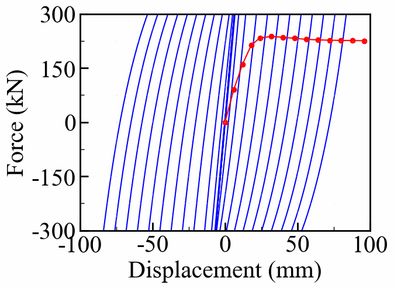
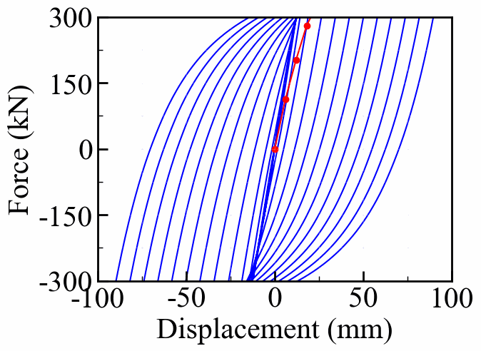
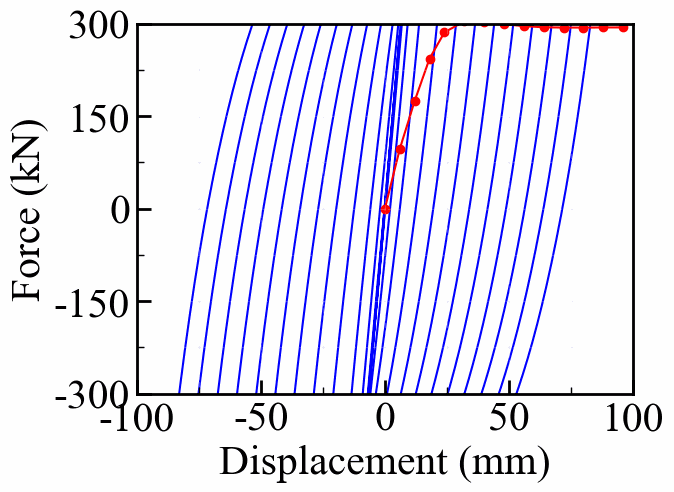
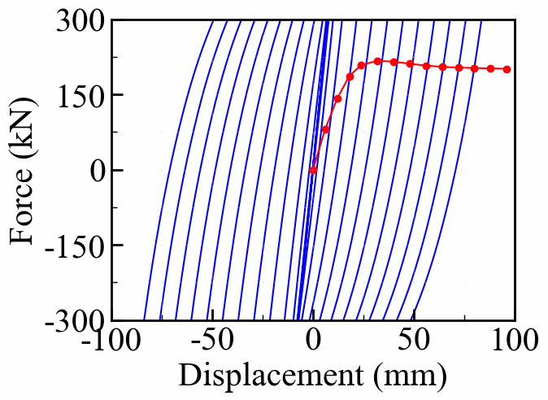
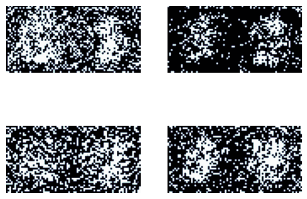
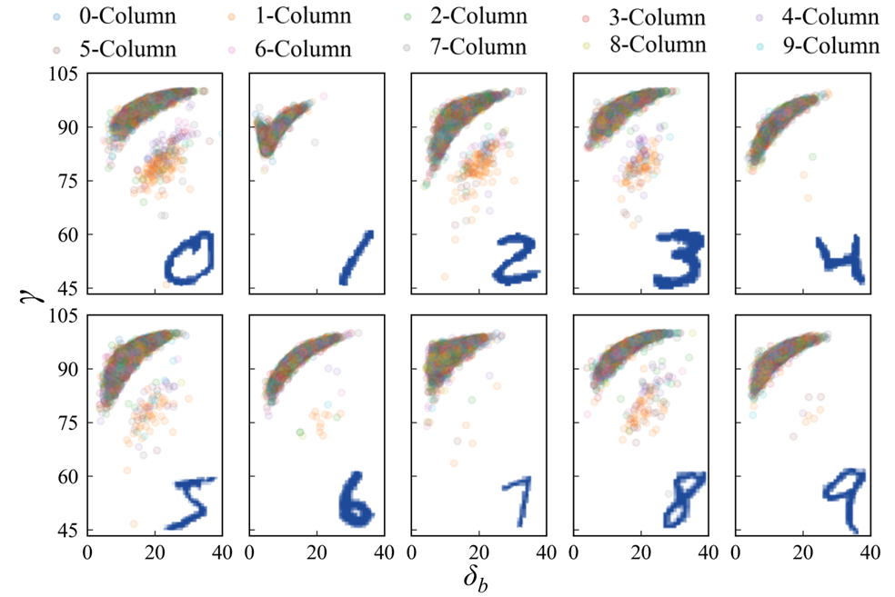
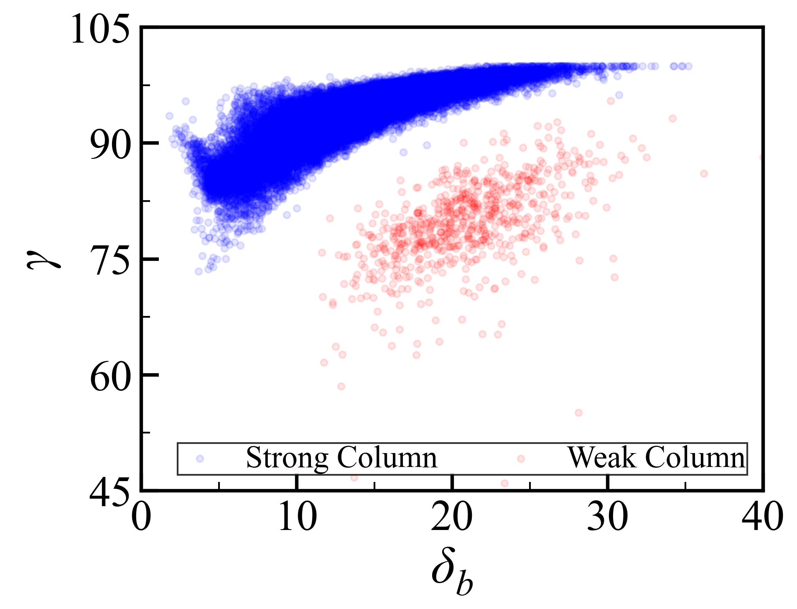

<div align=center>
  
# Inverse Design of Joints Section
# 梁柱节点截面逆向设计
</div> 


* *If you need more information. Please contact with caiyijiehehe@gmail.com*
* 如果你需要更多信息，请联系这个邮箱caiyijiehehe@gmail.com
<div align=center>
  
  
  
  
</div><br>    


<div align=center>
  
  
  
  
</div><br>   


<div align=center>
  
   <div align=center><strong>Results of the inverse design of Joints section</strong></div>
   <div align=center><strong>节点梁柱截面逆向设计动态结果</strong></div>
</div><br>   


<div align=center>
  
   <div align=center><strong>2D-40x80 Diffusion model architecture</strong></div>
   <div align=center><strong>2D-40x80 模型框架</strong></div>
</div><br>   

<!-- 数据集 -->
* ## **_The MNIST-Section Dataset_**

The digit portions were mapped to steel, while the remaining portions were mapped to concrete. Figure illustrates the relationship between the proportion of steel in the cross-section and the strength degradation of the columns after loading, categorized into ten classes corresponding to the digits 0 through 9. Weak column and strong beam lead to serious weakening of joint performance, which is not conducive to the generation of accuracy section. Therefore, the data set is cleaned as shown in Figure(red is eliminated).
</div><br>数字部分映射到钢，而其余部分映射到混凝土。图说明了横截面中的钢比例与加载后柱强度退化之间的关系，分为十类，对应于数字0到9。弱柱和强梁导致节点性能严重弱化，不利于模型生成准确有效的截面。因此，对数据集进行清洗（红色为被消除的）。
</div><br>

<div align=center>
  
  
   <div align=center><strong>Data cleaning(数据清洗)</strong></div>
</div><br>   


* ## ⚛️ **_Datasets & Weights_**  
* ## ⚛️ **_数据集和权重文件_**  
[**🔗The MNIST-Section dataset(数据集文件)**](https://github.com/YijieCai/Inverse-design-of-beam-column-joints/releases/tag/Dataset)     
[**🔗The Weights of the DDPM(权重文件)**](https://github.com/YijieCai/Inverse-design-of-beam-column-joints/releases/tag/Weight)


* The structure of the folder is as follows:
* 流程图如下:
```
  |--Main folder
          |--Make Dataset based on MNIST (基于MNIST建立数据集)
                |--Create Section Based on Mnist (Features) (数字截面作为特征)
                |--Calculate Using OpenSeespy (Label) (节点骨架曲线作为标签)
                |--Data Cleaning (数据清洗，去除弱柱强梁导致的异常骨架曲线)
          |--Diffusion_Dataset
                |--Test
                      |--Dataset_Test_unweak_2D.h5 (2D数据集, 80x40)
                      |--Dataset_Test_unweak_3D.h5 (Poor effect) (3D数据集, 2x40x40, 训练效果较差)
                |--Train
                      |--Dataset_Train_unweak_2D.h5 (2D数据集, 80x40)
                      |--Dataset_Train_unweak_3D.h5 (Poor effect) (3D数据集, 2x40x40, 训练效果较差)
          |--DDPM
                |--ConditionDiffusionModel.py (Unet网络)
                |--Dataset.py (打开数据集)
                |--Train_Diffusion.py (训练模型)
          |--Analysis
                |--Result of each model 
                |--Each epoch result comparsion (各个训练轮次下模型的生成效果)
                |--Each step result comparison (模型各个生成步骤下的生成效果)
                |--Model accuracy (模型准确度)
                |--Different demands (不同骨架曲线需求下的准确度)
                |--Exceed Target (超出训练范围的生成效果)
```
